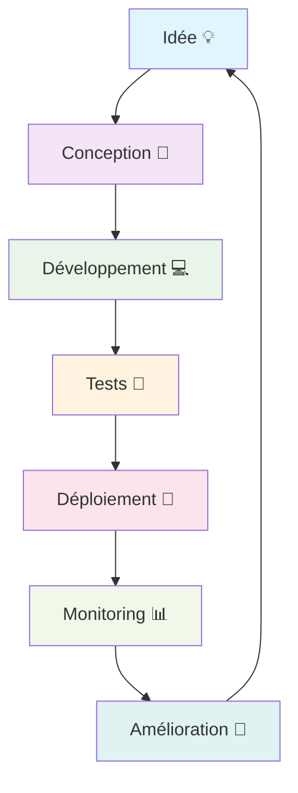

<div align="center">

# 🚀 Bienvenue sur mon profil GitHub !


[](https://linkedin.com/in/alfred-talom-743b842a5/)
[](https://dribbble.com/tfal237)
[](mailto:alfredlandrytalom2004@gmail.com)
[](https://twitter.com/votre-handle)

</div>

---

## 🎯 À propos de moi

```typescript
const developer = {
  name: "Styland Digital",
  role: "Développeur Full-Stack & Architecte IA",
  location: "Cameroun 🇨🇲",
  passion: ["Innovation", "IA", "Open Source", "Mentoring"],
  currentFocus: "Systèmes de Gestion Médicale avec IA",
  
  skills: {
    frontend: ["Next.js", "React", "TypeScript", "Tailwind CSS", "Framer Motion", "Radix UI"],
    backend: ["Node.js", "Python", "PostgreSQL", "Prisma", "Express", "NextAuth.js"],
    ai: ["Machine Learning", "Data Science", "Gemini AI", "TensorFlow", "PyTorch"],
    cloud: ["AWS", "Vercel", "Docker", "Kubernetes", "Cloudinary"],
    tools: ["Git", "VS Code", "Figma", "Postman", "TanStack Query", "SWR"]
  },
  
  funFact: "Je transforme les idées complexes en solutions simples et élégantes ✨"
};
```

---

## 🏥 Projet Phare : MediGest CMPD

<div align="center">

### 🚀 Système de Gestion Médicale Révolutionnaire

[](https://nextjs.org/)
[](https://www.typescriptlang.org/)
[](https://prisma.io/)
[](https://postgresql.org/)

</div>

**MediGest CMPD** est un système de gestion médicale complet qui révolutionne la façon dont les établissements de santé gèrent leurs opérations quotidiennes. Intégrant l'intelligence artificielle pour l'analyse prédictive et l'optimisation des processus.

### ✨ Fonctionnalités Révolutionnaires

<table>
<tr>
<td width="50%">

#### 🏥 **Gestion Médicale**
- 📋 Dossiers patients complets
- 🩺 Suivi des consultations
- 💊 Gestion pharmaceutique avancée
- 🔬 Services médicaux spécialisés

</td>
<td width="50%">

#### 💰 **Gestion Financière**
- 🧾 Facturation intelligente
- 💳 Paiements multi-modes
- 📊 Rapports financiers automatisés
- 📈 Analyses prédictives

</td>
</tr>
<tr>
<td width="50%">

#### 🤖 **Intelligence Artificielle**
- 🧠 Modèles ML personnalisés
- 📊 Analyses prédictives
- 🔍 Exploration de données
- 📤 Export de modèles IA

</td>
<td width="50%">

#### 📱 **Expérience Moderne**
- 📱 PWA (Progressive Web App)
- 🌐 Mode hors ligne
- 🔔 Notifications push
- 🔄 Synchronisation temps réel

</td>
</tr>
</table>

---

## 🛠️ Stack Technologique

<div align="center">

### 🎨 Frontend


### ⚙️ Backend


### 🤖 Intelligence Artificielle


### ☁️ Cloud & DevOps


</div>

---

## 📊 Statistiques GitHub

<div align="center">


</div>

---

## 🏆 Réalisations & Projets

### 🥇 Projets Notables

<table>
<tr>
<td width="33%">

#### 🏥 MediGest CMPD
**Système de Gestion Médicale**
- 🎯 Next.js + TypeScript + Prisma
- 🤖 IA intégrée pour analyses prédictives
- 📱 PWA avec mode hors ligne
- 🏆 **Impact** : Optimisation des processus médicaux

</td>
<td width="33%">

#### 🎓 BlissLearn
**Plateforme d'Apprentissage IA**
- 🧠 IA prédictive avec Gemini
- 🎮 Gamification complète
- 📊 Analytics avancés
- 🏆 **Impact** : Apprentissage personnalisé

</td>
<td width="33%">

#### 🌱 Trash-Mboa
**Gestion des Déchets**
- 📱 Mobile-first design
- 🗺️ Géolocalisation avancée
- 👥 Multi-rôles (Citoyen/Collecteur/Admin)
- 🏆 **Impact** : Environnement plus propre

</td>
</tr>
<tr>
<td width="33%">

#### 🎯 Educamer
**Plateforme Éducative**
- 📚 Suivi scolaire complet
- 🧪 Quiz et évaluations
- 💬 Forum communautaire
- 🏆 **Impact** : Éducation moderne

</td>
<td width="33%">

#### 🤖 Projets IA
**Machine Learning & Data Science**
- 🧠 Modèles prédictifs personnalisés
- 📊 Analyses de données avancées
- 🔍 Exploration et visualisation
- 🏆 **Impact** : Solutions intelligentes

</td>
<td width="33%">

#### 🌐 Architecture Cloud
**Microservices & DevOps**
- ⚡ Node.js + Express
- 🐳 Docker + Kubernetes
- ☁️ AWS Cloud Native
- 🏆 **Impact** : Scalabilité et performance

</td>
</tr>
</table>

---

## 🚀 Projets en Détail

### 🎓 BlissLearn - Plateforme d'Apprentissage IA
**Technologies** : Next.js 14, TypeScript, Prisma, Gemini AI, NextAuth.js

**Fonctionnalités clés** :
- 🧠 **IA Prédictive** : Recommandations personnalisées avec Gemini
- 🎮 **Gamification** : Badges, streaks, objectifs et récompenses
- 📊 **Analytics Avancés** : Graphiques prédictifs et statistiques détaillées
- 🔐 **Sécurité** : Authentification Google OAuth avec vérification email
- 📱 **PWA** : Mode hors ligne et notifications push

**Impact** : Révolutionne l'apprentissage en ligne avec une approche personnalisée et motivante.

### 🌱 Trash-Mboa - Gestion des Déchets
**Technologies** : Next.js 15, TypeScript, Radix UI, TanStack Query, Cloudinary

**Fonctionnalités clés** :
- 📱 **Mobile-First** : Design responsive optimisé pour tous les appareils
- 🗺️ **Géolocalisation** : Auto-détection GPS et autocomplétion d'adresses
- 👥 **Multi-Rôles** : Interface adaptée (Citoyen/Collecteur/Administrateur)
- 🚨 **Signalements** : Déchets et incidents environnementaux
- 🎨 **UI Moderne** : Design system cohérent avec animations fluides

**Impact** : Modernise la gestion des déchets pour un environnement plus propre.

### 🎯 Educamer - Plateforme Éducative
**Technologies** : Next.js 15, TypeScript, shadcn/ui, SWR, PWA

**Fonctionnalités clés** :
- 📚 **Suivi Scolaire** : Dashboard complet pour étudiants et enseignants
- 🧪 **Quiz Interactifs** : Évaluations et tests en ligne
- 💬 **Forum Communautaire** : Communication entre utilisateurs
- 📱 **PWA** : Application installable avec service worker
- 🎨 **Design Moderne** : Interface élégante avec Tailwind CSS

**Impact** : Transforme l'éducation avec des outils modernes et interactifs.

---

## 🎯 Objectifs 2024

- [ ] 🚀 **Lancer MediGest CMPD** en production
- [ ] 🎓 **Finaliser BlissLearn** avec IA avancée
- [ ] 🌱 **Déployer Trash-Mboa** dans plusieurs villes
- [ ] 🎯 **Optimiser Educamer** avec nouvelles fonctionnalités
- [ ] 🤖 **Développer 5 modèles IA** pour différents domaines
- [ ] 📚 **Contribuer à 10 projets** open source
- [ ] 🎓 **Mentorer 20 développeurs** juniors
- [ ] 🌍 **Expansion internationale** des projets

---

## 💡 Philosophie de Développement



---

## 🤝 Collaboration & Contribution

<div align="center">

### 🌟 Toujours ouvert aux collaborations !

[](https://github.com/Alfredlandry1)
[](https://linkedin.com/in/alfred-talom-743b842a5/)
[](mailto:alfredlandrytalom2004@gmail.com)

**💬 N'hésitez pas à me contacter pour :**
- 🤝 Collaborations sur des projets innovants
- 💡 Discussions sur l'IA et le Machine Learning
- 🎓 Mentoring et partage d'expérience
- 🚀 Opportunités de développement

</div>

---

## 🎨 Créativité & Innovation

<div align="center">

### 🎭 "L'innovation distingue un leader d'un suiveur" - Steve Jobs


</div>

---

<div align="center">

### 🚀 Merci de votre visite !


**⭐ N'oubliez pas de laisser une étoile si vous aimez mes projets !**

---

*Développé avec ❤️ et beaucoup de ☕ au Cameroun 🇨🇲*

</div>
